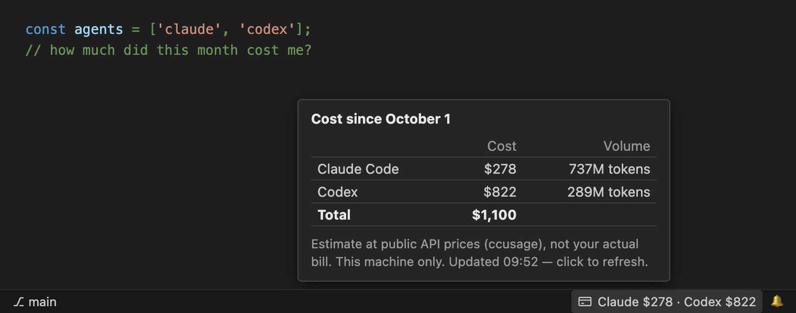

# Claude + Codex Cost

[](https://marketplace.visualstudio.com/items?itemName=lovisdotio.claude-codex-cost) [](https://marketplace.visualstudio.com/items?itemName=lovisdotio.claude-codex-cost)

**Now available on the VS Code Marketplace.**

See what **Claude Code** and **Codex** cost you since the 1st of the month, right in the VS Code status bar.



- One status bar item: `Claude $278 · Codex $822`
- Hover for the breakdown (cost, token volume, total). Click to refresh.
- Refreshes every 5 minutes and resets on the 1st of each month.
- Nothing to configure, no account, no API key. It reads the logs Claude Code (`~/.claude`) and Codex (`~/.codex`) already write on your machine.
- English or French, following VS Code's language.

## Install

Search **Claude + Codex Cost** in the VS Code Extensions view, or get it from the [Visual Studio Marketplace](https://marketplace.visualstudio.com/items?itemName=lovisdotio.claude-codex-cost). From a terminal:

```sh
code --install-extension lovisdotio.claude-codex-cost
```

Offline install: download `claude-codex-cost.vsix` from the [latest release](https://github.com/lovisdotio/claude-codex-cost/releases/latest), then `code --install-extension claude-codex-cost.vsix`.

Works on macOS, Linux and Windows (x64 and arm64).

## How the numbers are computed

The extension bundles [ccusage](https://github.com/ryoppippi/ccusage) (MIT), which totals your token usage from the local logs and prices it at public API rates. So:

- It's an **estimate at API prices**, not your bill. On a Claude or ChatGPT subscription, it shows what the same usage would cost pay-as-you-go.
- It counts **this machine only**.

## License

MIT. Bundles ccusage binaries (MIT, © ryoppippi).
